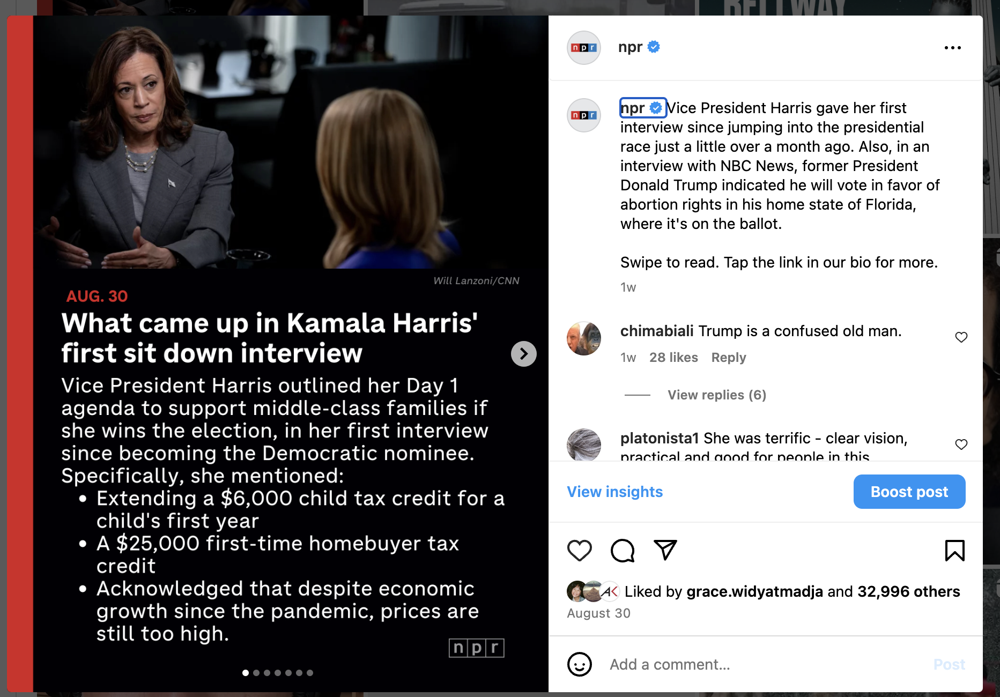
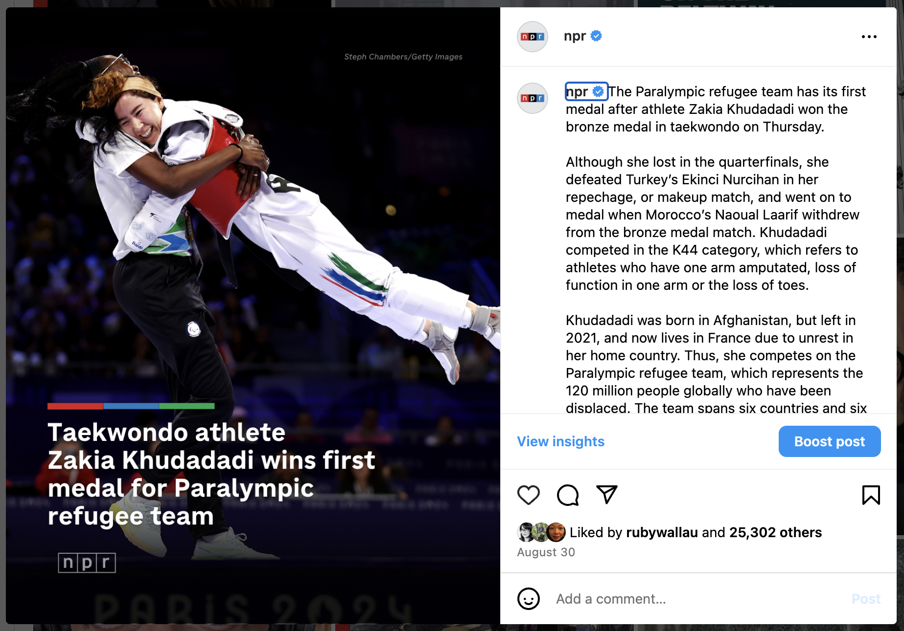

## NPR
### Summary: 
Developing and experimenting the creation of content for social media on  Instagram reels,  stories, animations with text and audio, text-based social media posts, Tiktok  for over 20 Million followers across social vertical platforms.

Worked on strategies alongside video, photo teams to create daily videos to represent NPR's reporting.

Working in collaboration with member stations from NPR's network on best practices for instagram posts and short-form video strategies.

{.lightbox width=500} 

{.lightbox width=500} 

{.lightbox width=500} 